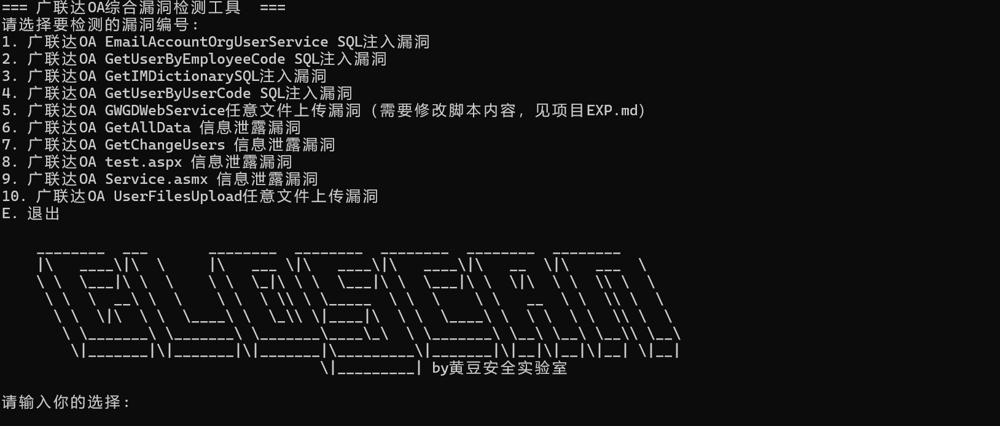

**广联达OA系统nday漏洞批量检测工具**

fofa body="/Services/Identification/"
鹰图 app.name="广联达 OA"


可检测的漏洞列表：
```
广联达OA EmailAccountOrgUserService SQL注入漏洞
广联达OA GetUserByEmployeeCode SQL注入漏洞
广联达OA GetIMDictionarySQL注入漏洞
广联达OA GetUserByUserCode SQL注入漏洞
广联达OA GWGDWebService任意文件上传漏洞
广联达OA GetAllData 信息泄露漏洞
广联达OA GetChangeUsers 信息泄露漏洞
广联达OA test.aspx 信息泄露漏洞
广联达OA Service.asmx 信息泄露漏洞
广联达OA UserFilesUpload任意文件上传漏洞
```
用法：

python main.py -u https://xxxxx.xxxx/  检测单个目标  

python main.py -t urls.txt批量检测目标，请将txt文件与main.py放于统一目录下

在菜单使用数字选择要检测的漏洞模块，其中广联达OA GWGDWebService任意文件上传漏洞需要修改脚本内容，见项目EXP.md



扫描出漏洞后利用注意事项

POC收集与整理感谢微信公众号 银遁安全团队
